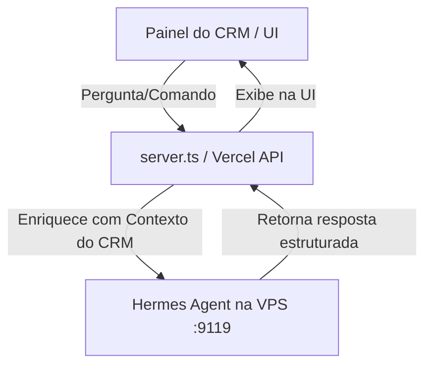

# Plano de Implementação - Copiloto Clínico Interno (Hermes)

Este plano define a integração do **Hermes Agent** como um copiloto de inteligência artificial 100% interno para o cirurgião-dentista, integrado diretamente no painel do CRM (sem disparar mensagens automáticas para os pacientes, eliminando qualquer conflito com a IA nativa da Meta).

## Objetivos e Escopo
1. **Zero Interferência na Meta**: O Hermes atuará apenas nos bastidores da aplicação, respondendo às requisições do Dentista dentro da Dashboard.
2. **Geração de Documentos e Orientações**: Criação ágil de textos pós-operatórios personalizados, receitas e resumos de prontuários.
3. **Análise de Faturamento e Agenda**: Permitir que o dentista faça perguntas sobre o status financeiro e procedimentos agendados diretamente ao Hermes na Central IA.

---

## Proposta de Arquitetura

---

## Modificações Propostas

### 1. [NEW] [hermes-copilot.ts](file:///c:/Users/agnal/Downloads/sistema-aistudio/api/agent/copilot.ts)
Criar um endpoint `/api/agent/copilot` que receberá:
- `patientId` (opcional): se fornecido, o backend busca os dados do paciente, histórico clínico e tratamentos no Supabase para anexar à pergunta.
- `command` (ex: "gerar orientações pós-clareamento", "resumir prontuário", "analisar faturamento semanal").

Este endpoint:
1. Monta um prompt rico com os dados contextuais do CRM do paciente correspondente.
2. Repassa a pergunta ao Hermes Agent na VPS usando a API interna que mapeamos (`/api/sessions` ou `/api/agent/chat`).
3. Retorna a resposta limpa e formatada para o frontend.

### 2. [MODIFY] [SentinelDashboard.tsx](file:///c:/Users/agnal/Downloads/sistema-aistudio/src/components/SentinelDashboard.tsx)
- Transformar a Central IA em um painel duplo ou adicionar abas:
  - **Aba 1: Auditoria VPS (Sentinel)**: Exibe os logs de erros técnicos e performance como já funciona.
  - **Aba 2: Copiloto Clínico**: Uma interface de chat dedicada onde você pode fazer perguntas rápidas baseadas no banco de dados do CRM (ex: *"Quem são os pacientes de amanhã?"*, *"Qual a receita total deste mês?"*).

---

## Plano de Verificação

### Testes Manuais
- Verificar se as consultas de faturamento e resumos clínicos retornam respostas clinicamente corretas no chat.
- Garantir que nenhuma mensagem de teste seja enviada para o WhatsApp do paciente.
