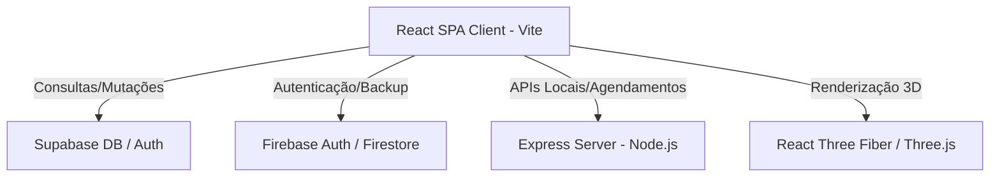

# Arquitetura do Sistema - Módulo Odontológico 3D

## 1. Visão Geral Tecnológica
O sistema baseia-se em uma arquitetura Single Page Application (SPA) construída com **React 19** e **Vite**, utilizando **TypeScript** para tipagem estática e **TailwindCSS** para estilização. O servidor backend é implementado em **Node.js (Express + tsx)**.



## 2. Tecnologias Principais
- **Frontend Core**: React 19, TypeScript, TailwindCSS, Motion (Framer Motion).
- **Visualização 3D**: `three` (Three.js), `@react-three/fiber` (R3F), `@react-three/drei`.
- **Backend / API**: Express, Zod (validação), tsx (execução TypeScript).
- **Banco de Dados & Storage**: Supabase (PostgreSQL para dados clínicos e estruturados) e Firebase (Firestore/Auth para controle auxiliar e upload de mídias).

## 3. Estrutura de Pastas e Componentes
O fluxo de arquivos do frontend segue a seguinte organização:

```
src/
├── components/          # Componentes reutilizáveis do sistema
│   ├── ClinicalAttendanceManager.tsx  # Gestor de atendimentos e odontograma
│   ├── DentalCRMView.tsx             # Visão geral de relacionamento e funil
│   ├── ProposalViewer.tsx             # Emissor e visualizador de orçamentos
│   └── ...
├── context/             # Gerenciamento de estado global (React Context)
│   └── PatientContext.tsx  # Contexto de pacientes, anamnese e orçamentos
├── types.ts             # Tipagens centrais (Paciente, Procedimento, Proposta, etc.)
├── constants.ts         # Valores padrão, listas de procedimentos e mocks
├── index.css            # Estilos globais e tokens de design (Tailwind)
└── main.tsx             # Ponto de entrada da aplicação
```

## 4. Estado da Aplicação (State Management)
- **Global Context (`PatientContext`)**: Encapsula os dados do paciente ativo, histórico de consultas, diagnósticos registrados e orçamentos gerados.
- **Local State (React `useState`, `useRef`)**: Utilizado para interações específicas da UI, como o estado de rotação do visualizador 3D, hover nos dentes e inputs de formulários temporários.
- **Optimistic Updates**: As alterações no odontograma ou orçamentos são aplicadas localmente na UI instantaneamente antes da confirmação da sincronização com o banco de dados.

## 5. Fluxo de Dados e Integração do Visualizador 3D
1. **Carregamento do Modelo**: O componente do Visualizador 3D carrega o arquivo `.gltf` / `.obj` representando a arcada dentária, utilizando a diretiva `useGLTF` do `@react-three/drei` com suporte a cache.
2. **Raycasting**: Ao clicar sobre um dente no canvas 3D, a biblioteca intercepta o evento (Raycast) e identifica o ID do dente clicado (código FDI).
3. **Seleção e Detalhes**: O ID é enviado para o `PatientContext`, que abre a gaveta lateral (drawer) para seleção de superfícies e associação de procedimentos.
4. **Atualização Visual**: Após associar um procedimento (ex: restauração na Oclusal), o material da respectiva superfície do dente 3D é atualizado dinamicamente com a cor correspondente.
5. **Budget Link**: O motor de orçamentos detecta a inserção do procedimento e recalcula o valor total da proposta em tempo real.
