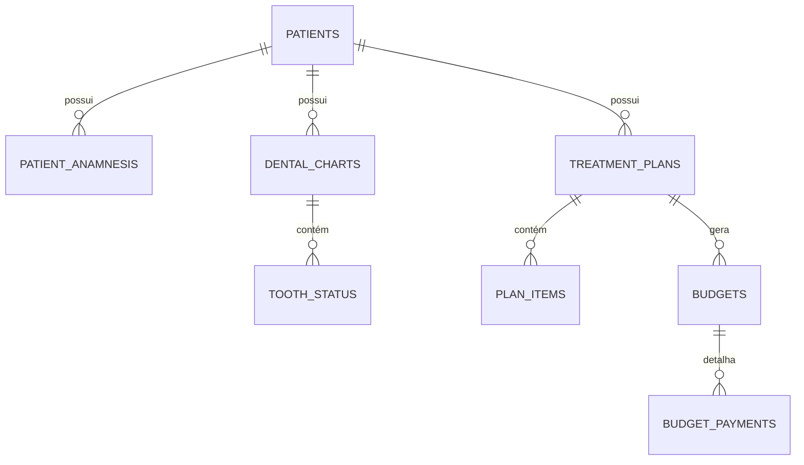

# Modelagem de Banco de Dados - Módulo Clínico e 3D

Este documento detalha o esquema de tabelas e as relações necessárias para suportar a seleção de dentes, os planos de tratamento e o motor de orçamentos. A persistência principal é estruturada para **PostgreSQL (Supabase)**, com estruturas equivalentes em documentos no **Firestore (Firebase)**.

## 1. Diagrama de Relações (ERD)

## 2. Dicionário de Dados (Tabelas)

### 2.1. `patients` (Pacientes)
Armazena os dados pessoais e cadastrais básicos.
- `id` (UUID, PK): Identificador único do paciente.
- `name` (VARCHAR, Not Null): Nome completo.
- `cpf` (VARCHAR, Unique): Cadastro de Pessoa Física.
- `email` (VARCHAR)
- `phone` (VARCHAR): WhatsApp ou telefone de contato.
- `birth_date` (DATE)
- `created_at` (TIMESTAMP)

### 2.2. `patient_anamnesis` (Anamnese)
Histórico médico preenchido no primeiro contato.
- `id` (UUID, PK)
- `patient_id` (UUID, FK -> `patients.id` ON DELETE CASCADE)
- `allergies` (TEXT): Alergias medicamentosas ou alimentares.
- `systemic_diseases` (TEXT): Problemas de saúde gerais.
- `medications_in_use` (TEXT): Remédios que consome.
- `observations` (TEXT)
- `updated_at` (TIMESTAMP)

### 2.3. `dental_charts` (Odontogramas)
Cabeçalho do prontuário visual (pode haver mais de um histórico por paciente ao longo dos anos).
- `id` (UUID, PK)
- `patient_id` (UUID, FK -> `patients.id` ON DELETE CASCADE)
- `dentist_id` (UUID): Dentista responsável pelo exame.
- `notes` (TEXT): Observações clínicas gerais.
- `created_at` (TIMESTAMP)

### 2.4. `tooth_status` (Status dos Dentes e Superfícies)
Mapeamento do estado atual de cada dente do paciente no modelo 3D.
- `id` (UUID, PK)
- `chart_id` (UUID, FK -> `dental_charts.id` ON DELETE CASCADE)
- `tooth_number` (INT, Not Null): Número FDI do dente (ex: 11 a 48).
- `surface` (VARCHAR): Superfície afetada (`M`esial, `D`istal, `O`clusal, `V`estibular, `L`ingual, `P`alatina, `A`ll para dente inteiro).
- `condition` (VARCHAR): Condição clínica (`CARIES`, `RESTORATION_OK`, `RESTORATION_FAIL`, `IMPLANT`, `MISSING`, `ENDODONTIC`).
- `notes` (TEXT): Notas específicas do dente.
- `updated_at` (TIMESTAMP)

### 2.5. `treatment_plans` (Planos de Tratamento)
Proposta clínica com as fases recomendadas.
- `id` (UUID, PK)
- `patient_id` (UUID, FK -> `patients.id` ON DELETE CASCADE)
- `title` (VARCHAR): Nome do plano (ex: "Reabilitação Oral Superior").
- `status` (VARCHAR): Estado do plano (`DRAFT`, `PROPOSED`, `ACCEPTED`, `COMPLETED`, `CANCELLED`).
- `created_at` (TIMESTAMP)

### 2.6. `plan_items` (Itens do Plano de Tratamento)
Procedimentos recomendados em dentes específicos.
- `id` (UUID, PK)
- `plan_id` (UUID, FK -> `treatment_plans.id` ON DELETE CASCADE)
- `tooth_number` (INT): Número FDI opcional (nulo para procedimentos gerais como limpeza).
- `surface` (VARCHAR): Superfície opcional.
- `procedure_code` (VARCHAR): Código do procedimento na tabela da clínica.
- `procedure_name` (VARCHAR): Descrição do procedimento.
- `phase` (INT): Fase do tratamento (1, 2, 3, etc.).
- `status` (VARCHAR): Estado do item (`PENDING`, `IN_PROGRESS`, `DONE`, `CANCELLED`).

### 2.7. `budgets` (Orçamentos)
O fechamento financeiro vinculado a um plano.
- `id` (UUID, PK)
- `plan_id` (UUID, FK -> `treatment_plans.id` ON DELETE CASCADE)
- `subtotal` (DECIMAL(10,2)): Soma dos valores brutos dos procedimentos.
- `discount` (DECIMAL(10,2)): Valor de desconto aplicado.
- `total` (DECIMAL(10,2)): Valor líquido final.
- `status` (VARCHAR): Estado do orçamento (`PENDING`, `APPROVED`, `REJECTED`, `EXPIRED`).
- `payment_method` (VARCHAR): Forma de pagamento principal.
- `created_at` (TIMESTAMP)

### 2.8. `budget_payments` (Parcelamento e Detalhes de Pagamento)
Informações de fluxo de caixa gerado pela aprovação do plano.
- `id` (UUID, PK)
- `budget_id` (UUID, FK -> `budgets.id` ON DELETE CASCADE)
- `installment_number` (INT): Número da parcela.
- `amount` (DECIMAL(10,2)): Valor da parcela.
- `due_date` (DATE): Data de vencimento.
- `status` (VARCHAR): Estado da parcela (`PENDING`, `PAID`, `OVERDUE`).
