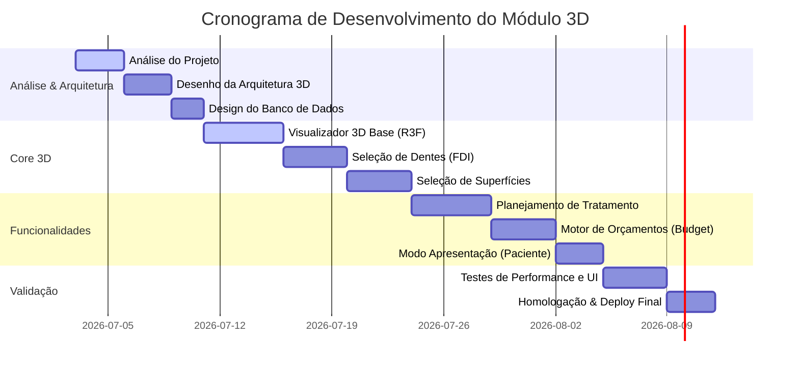

# Cronograma e Roadmap de Desenvolvimento

Este documento apresenta as etapas planejadas para a implementação completa do **Visualizador 3D e Motor de Orçamentos** integrado ao sistema.

## Linha do Tempo Geral

## Fases do Roadmap

### Fase 1: Fundação, Análise e Modelagem de Dados
- **Análise do Repositório**: Compreensão dos componentes atuais (`DentalCRMView.tsx`, `ClinicalAttendanceManager.tsx`) e do modelo de dados.
- **Modelagem da Arquitetura**: Definição da comunicação entre o Canvas 3D e o Contexto React.
- **Estruturação do Banco**: Criação das tabelas de histórico do Odontograma, planos de tratamento e propostas financeiras.

### Fase 2: Implementação do Visualizador 3D (R3F)
- Importação e otimização dos modelos 3D dos dentes permanentes e decíduos (formato GLB/GLTF).
- Configuração de iluminação, sombras e câmera orbital responsiva no Canvas.
- Raycasting para seleção de dentes via clique no modelo 3D.

### Fase 3: Detalhamento Clínico (Dentes e Superfícies)
- Mapeamento individual de superfícies por dente (Mesial, Distal, Oclusal, Vestibular, Lingual).
- Alteração dinâmica de cores de superfícies baseado em patologias ou tratamentos aplicados.
- Integração da legenda de cores internacional de odontograma.

### Fase 4: Planejamento Clínico e Acoplamento Financeiro
- Vinculação de tabelas de procedimentos a diagnósticos selecionados no 3D.
- Atualização em lote (ex: selecionar múltiplos dentes para profilaxia).
- Cálculo em tempo real de itens de orçamento baseados na tabela de preços do consultório.

### Fase 5: Modo de Apresentação e Geração de Propostas
- Painel focado na venda de tratamentos para o paciente (Interface minimalista, simulações de antes/depois).
- Geração de PDF da proposta integrando o estado visual final do odontograma 3D.
- Assinatura na tela para aceitação do paciente.

### Fase 6: Otimização de Performance e Homologação
- Otimização do peso dos arquivos 3D (compressão Draco).
- Garbage collection de instâncias do ThreeJS para evitar vazamento de memória em navegação repetida.
- Testes unitários de regras de cálculo e testes end-to-end do fluxo clínico.
