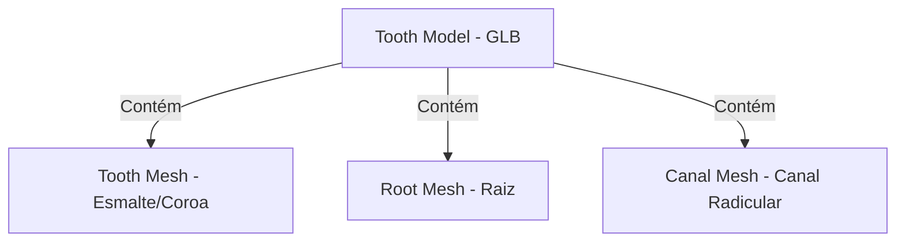

# Arquitetura do Sistema - Módulo TreatmentPlanning3D

## 1. Diretrizes Principais de Integração
Para assegurar a manutenibilidade do sistema e evitar regressões, o desenvolvimento deste módulo seguirá as seguintes premissas:
- **Novos Componentes**: Todo o fluxo visual e interativo será isolado no novo módulo chamado `TreatmentPlanning3D`.
- **Zero Modificação**: Nenhum componente pré-existente (como `ClinicalAttendanceManager.tsx`, `DentalCRMView.tsx`, etc.) deve ser modificado diretamente.
- **Independência**: Os novos componentes devem ser independentes e plugáveis, comunicando-se com o restante do ecossistema de maneira desacoplada.

---

## 2. Tecnologias e Formatos 3D
- **Renderização**: Utilização de **React Three Fiber (R3F)** (`@react-three/fiber`) e helpers do `@react-three/drei` sobre o **Three.js**.
- **Modelos 3D**: Uso exclusivo do formato **GLB** (versão binária comprimida do GLTF) contendo os modelos tridimensionais dos dentes, raízes e canais de forma individualizada.

---

## 3. Estruturação Geométrica (Meshes no Modelo 3D)
A estrutura organizacional das malhas (meshes) dentro do visualizador 3D será mapeada para permitir controle e realce individual:
- **Cada Dente será um Mesh**: Permitindo cliques individuais, detecção de superfícies e aplicação de cores para restaurações ou facetas.
- **Cada Raiz será um Mesh**: Permitindo ocultar/exibir a raiz, e pintar lesões ou simular perda óssea.
- **Cada Canal será um Mesh**: Permitindo destacar visualmente quando um tratamento endodôntico (canal) for planejado ou executado.



---

## 4. Estrutura de Lógica e Estado Próprios
O módulo encapsulará sua própria lógica de negócio, dados e chamadas externas para se manter independente:
- **Context Próprio (`TreatmentPlanning3DContext`)**: Gerenciará o estado local do visualizador, como o dente ativo, dentes selecionados, superfícies selecionadas, visualizações ativas (ex: modo transparência de gengiva) e diagnósticos aplicados.
- **Hook Próprio (`useTreatmentPlanning3D`)**: Encapsulará os seletores de estado e funções de despacho de ações (ex: `selectTooth()`, `applyTreatment()`), facilitando o consumo por componentes da interface.
- **Service Próprio (`TreatmentPlanning3DService`)**: Lidará com as chamadas de persistência ao Supabase/Firebase específicas do módulo, incluindo salvar dados de odontogramas tridimensionais e histórico do tratamento, sem misturar com services globais.

---

## 5. Fluxo de Arquivos Recomendado
Os arquivos do novo módulo devem ser mantidos agrupados:
```
src/
├── TreatmentPlanning3D/
│   ├── components/
│   │   ├── DentalCanvas3D.tsx     # Canvas principal R3F
│   │   ├── ToothMesh.tsx          # Componente para lidar com as meshes (Dente, Raiz, Canal)
│   │   └── ControlPanel3D.tsx     # Painel lateral ou inferior de interações
│   ├── context/
│   │   └── Planning3DContext.tsx  # Contexto exclusivo
│   ├── hooks/
│   │   └── usePlanning3D.ts       # Hook customizado
│   ├── services/
│   │   └── planning3DService.ts   # Service de API / Persistência
│   └── types.ts                   # Tipos e interfaces específicas do módulo
```
