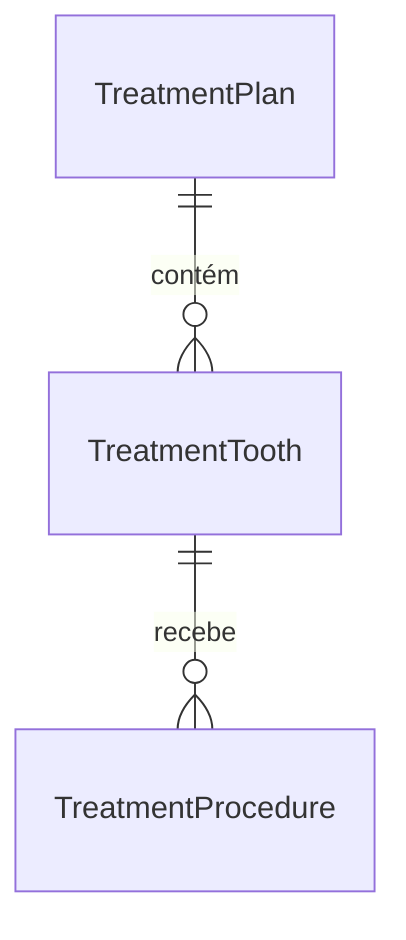

# Modelagem de Banco de Dados - Módulo TreatmentPlanning3D

Este documento detalha o esquema de tabelas e as relações necessárias para suportar a seleção de dentes, os planos de tratamento e os procedimentos vinculados no módulo **TreatmentPlanning3D**.

## 1. Diagrama de Entidade-Relacionamento (ERD)



---

## 2. Estrutura das Tabelas (Dicionário de Dados)

### 2.1. Tabela: `TreatmentPlan`
Armazena a proposta macro do plano de tratamento para o paciente.
- `id` (UUID / SERIAL, PK): Identificador único do plano de tratamento.
- `patient_id` (UUID, Not Null): Referência ao paciente cadastrado.
- `created_at` (TIMESTAMP, Default `now()`): Data de criação do plano.
- `status` (VARCHAR, Not Null): Situação do plano (ex: `DRAFT`, `PROPOSED`, `ACCEPTED`, `COMPLETED`, `CANCELLED`).

### 2.2. Tabela: `TreatmentTooth`
Armazena o estado clínico mapeado para cada dente específico dentro de um determinado plano de tratamento.
- `id` (UUID / SERIAL, PK): Identificador único do dente no plano.
- `plan_id` (UUID / INT, FK -> `TreatmentPlan.id` ON DELETE CASCADE): Associação com o plano de tratamento.
- `tooth` (INT, Not Null): Número do dente de acordo com a notação internacional FDI (ex: 11 a 48).
- `condition` (VARCHAR, Not Null): Condição ou patologia identificada (ex: `CARIES`, `FRACTURE`, `MISSING`, `PULPITIS`, `BONE_LOSS`).
- `notes` (TEXT): Observações clínicas específicas sobre o dente.

### 2.3. Tabela: `TreatmentProcedure`
Armazena os procedimentos propostos e precificados para cada dente diagnosticado.
- `id` (UUID / SERIAL, PK): Identificador único do procedimento.
- `tooth_id` (UUID / INT, FK -> `TreatmentTooth.id` ON DELETE CASCADE): Associação com o dente diagnosticado.
- `procedure` (VARCHAR, Not Null): Nome ou código do procedimento executado (ex: `CANAL`, `IMPLANTE`, `RESTAURACAO`, `FACETA`).
- `price` (DECIMAL(10,2), Not Null): Valor cobrado pelo procedimento.

---

## 3. Scripts SQL de Criação (PostgreSQL / Supabase)

Abaixo estão os scripts DDL prontos para execução no banco de dados:

```sql
-- Criação da tabela de Planos de Tratamento
CREATE TABLE IF NOT EXISTS "TreatmentPlan" (
    "id" UUID PRIMARY KEY DEFAULT gen_random_uuid(),
    "patient_id" UUID NOT NULL,
    "created_at" TIMESTAMP WITH TIME ZONE DEFAULT timezone('utc'::text, now()) NOT NULL,
    "status" VARCHAR(50) DEFAULT 'DRAFT' NOT NULL,
    CONSTRAINT fk_patient FOREIGN KEY ("patient_id") REFERENCES "patients"("id") ON DELETE CASCADE
);

-- Criação da tabela de Dentes Associados ao Plano
CREATE TABLE IF NOT EXISTS "TreatmentTooth" (
    "id" UUID PRIMARY KEY DEFAULT gen_random_uuid(),
    "plan_id" UUID NOT NULL,
    "tooth" INT NOT NULL,
    "condition" VARCHAR(100) NOT NULL,
    "notes" TEXT,
    CONSTRAINT fk_treatment_plan FOREIGN KEY ("plan_id") REFERENCES "TreatmentPlan"("id") ON DELETE CASCADE,
    CONSTRAINT chk_tooth_fdi CHECK (("tooth" BETWEEN 11 AND 48) OR ("tooth" BETWEEN 51 AND 85))
);

-- Criação da tabela de Procedimentos Aplicados ao Dente
CREATE TABLE IF NOT EXISTS "TreatmentProcedure" (
    "id" UUID PRIMARY KEY DEFAULT gen_random_uuid(),
    "tooth_id" UUID NOT NULL,
    "procedure" VARCHAR(200) NOT NULL,
    "price" DECIMAL(10, 2) NOT NULL CHECK ("price" >= 0),
    CONSTRAINT fk_treatment_tooth FOREIGN KEY ("tooth_id") REFERENCES "TreatmentTooth"("id") ON DELETE CASCADE
);
```
